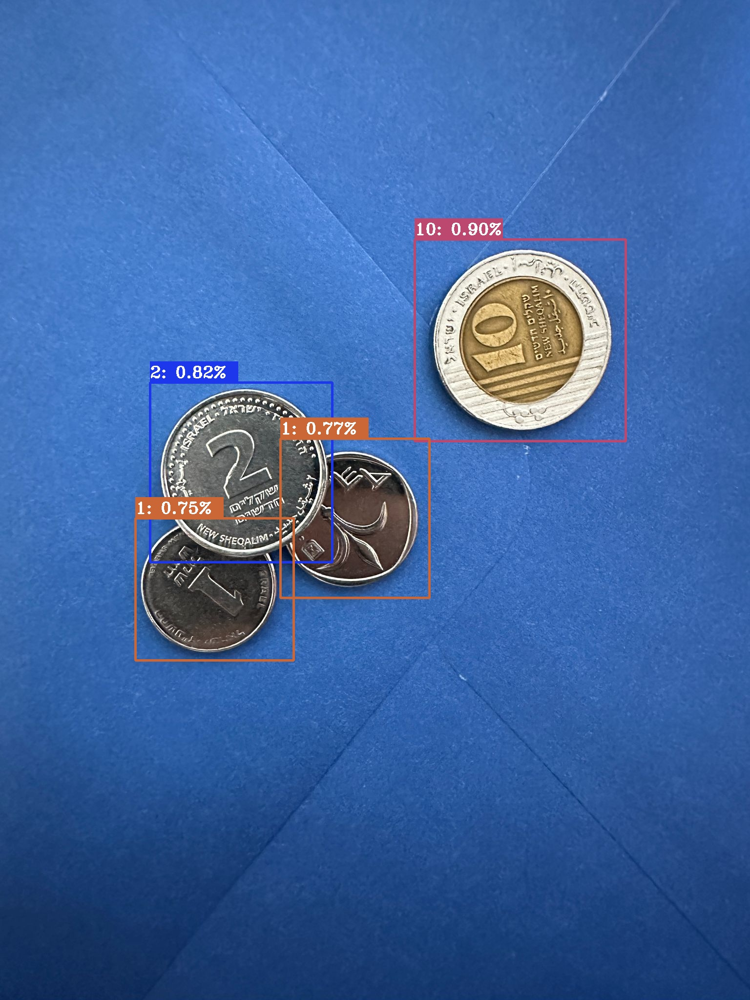

# Coin Detector Project by Ziv Attias

## Overview

This project uses the YOLOv5 architecture to detect coins in images. The YOLOv5 model is initialized and trained to recognize different coin types and their values. The project includes scripts to run the model and process the images.

<div style="text-align: center;">

</div>

## Project Structure

```
coin-detector/
├── .vscode/
├── datasets/
├── modules/
├── yolov5/
├── Pipfile
├── Pipfile.lock
└── README.md
```

- `.vscode/`: Contains VS Code specific settings.
- `datasets/`: Directory containing the dataset for coin detection.
- `modules/`: Contains Python modules and scripts.
- `yolov5/`: Contains the YOLOv5 implementation.
- `Pipfile` & `Pipfile.lock`: Used for managing dependencies with pipenv.
- `README.md`: This file.

## Setup

To set up the project, follow these steps:

### 1. Install Dependencies

* This project uses `pipenv` to manage dependencies. First, make sure `pipenv` is installed:

```sh
pip install pipenv
```

* Then, navigate to the project directory and install the dependencies:

```sh
pipenv install
```

### 2. Enter Pipenv shell (environment)

* To work within the virtual environment created by pipenv, enter the shell:
  
```sh
pipenv shell
```

* It worked if your terminal has detected its new shell:
```sh
  (coin-detector) ➜  coin-detector: ...
```

### 3. Running the model:

* To run the model and start the coin detection, execute the sum.py script located in the modules directory:
  
```sh
python modules/sum.py
OR
python -m modules.sum 
```
* Example valid output:
```
Initializing and loading model. This process may take a few seconds, please wait.
If this process takes more than a minute or two, please re-run sum.py!

YOLOv5 🚀 v7.0-345-g8003649c Python-3.12.4 torch-2.3.1 CPU

Fusing layers... 
Model summary: 157 layers, 7020913 parameters, 0 gradients, 15.8 GFLOPs
Adding AutoShape... 

Saved image with predictions to: datasets/coin_detector_test/predictions/3cf57650-4886-4176-8ac2-1d61935fb7b3.jpeg

Saved image with predictions to: datasets/coin_detector_test/predictions/81b3329e-ae93-499e-952a-40b09f86178a.jpeg

(...)

Image: 3cf57650-4886-4176-8ac2-1d61935fb7b3
Detected ILS: 15
Ground-Truth ILS: 14
Accuracy: 92.86%

Image: 81b3329e-ae93-499e-952a-40b09f86178a
Detected ILS: 2
Ground-Truth ILS: 2
Accuracy: 100.00%

(...)

Average accuracy on test set: 84.98%
```


## Architecture

### YOLOv5

YOLOv5 (You Only Look Once version 5) is a state-of-the-art object detection model that achieves high accuracy and speed. It is used in this project to initialize the architecture and train the model for detecting coins. YOLOv5 is known for its efficient detection capabilities and has been widely adopted in various computer vision tasks.

How YOLOv5 is Used:
1.	Initialization: The YOLOv5 model is initialized using pretrained weights. This allows the model to leverage pre-learned features for better accuracy.
2.	Training: The model is trained on a dataset of coin images. The training process fine-tunes the model to detect and classify different types of coins.
3.	Detection: The trained model is then used to detect coins in new images, drawing bounding boxes around detected coins and labeling them with their values.

For more details on YOLOv5, you can visit the <a href="https://github.com/ultralytics/yolov5">YOLOv5 GitHub repository</a>.


  
